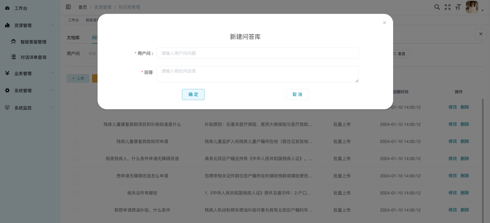
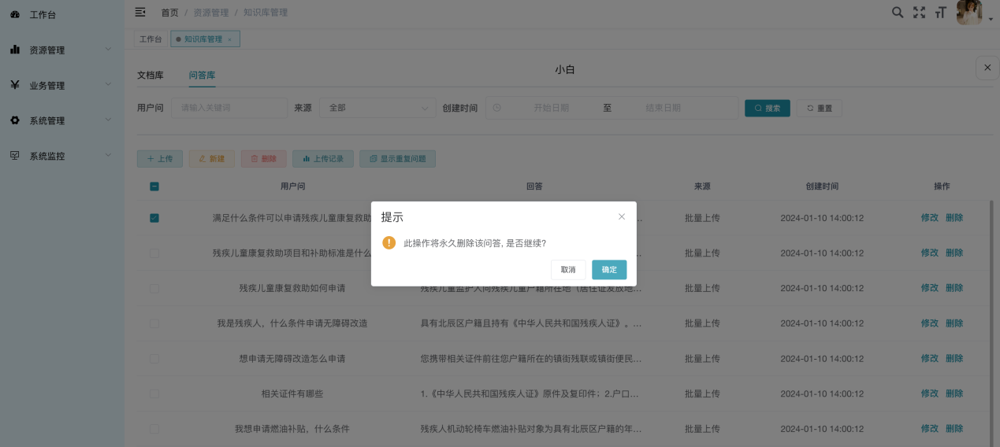
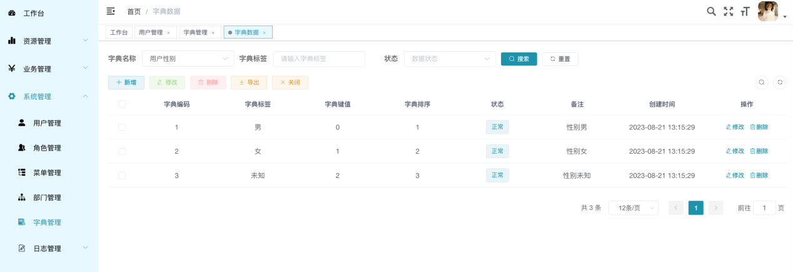

# 上海奥图科技 奥图大模型智能机器人

## 产品使用说明文档

### 登陆

1. 网址

    - 奥图智能客服支持私有化部署，可自定义一个符合品牌标识的个性化域名，使企业内员工能够轻松访问系统。

2. 账号密码

    - 进入到系统登录页面，输入账号（账号为2～20位数字、字母或标点中的至少一种）和密码（密码为5~20位，需要包含字母、数字和标点），然后输入验证码，点击登录按钮，即可登录。

    

### 工作台

- 登录成功后会进入到工作台页面，在这个页面上可以查看当前企业的资源使用情况、常用功能快捷入口，以及客服对话快捷入口。

    

   1. 资源使用情况

       - 可查看当前开通智能客服数量/客服数量上限；已上传文件数量/上传文件数量上限。

   2. 快捷入口
       - 智能客服管理页面、知识库管理、用户管理、客服模版管理。

   3. 客服对话快捷入口

      - 可快速使用当前所有启用的智能客服，可查看该客服当日总回答次数和当日接待人数。在计算当日接待人数时，如果发生对话的场景不需要用户登录时，同一个ip的用户计算为一服务人次。

### 资源管理

   1. 智能客服管理

        1. 筛选客服模版

           - 可查看全部模版的智能客服，也可查看独立模版的智能客服。

        2. 创建智能客服

            - 点击创建智能客服按钮，填写智能客服的昵称，填写公司昵称，选择客服模版，点击确定按钮即可创建成功。

        

        3. 与智能客服对话

            - 选择一个智能客服点击进入，即可进行对话。

        4. 管理知识库

            1.  文档库

            2.  问答库

        

            3. 批量上传

            点击上传按钮，下载模版，在本地编辑完成后，点击选取文件按钮，选择编辑好的excel表格，点击确定按钮即可完成上传。每次最多支持上传10格文件。

        

            4.  手动新建

            点击新建按钮，填写用户问和回答，点击确定按钮，即可完成手动新增数据。

        

            5.  修改数据

            找到需要修改的数据，点击后方修改按钮，即可编辑用户问或回答，修改完成之后点击确定按钮进行保存。

        

            6.  删除数据

            勾选一条或多条数据，点击删除按钮，点击确定按钮即可删除数据。删除数据后不可恢复，请谨慎操作。

        

            7.  上传记录

            点击上传记录按钮，即可查看上传历史，包括上传人、上传日期、文件名称、文件大小和对应客服。

        

            8.  显示重复问题

            点击显示重复问题按钮，可以查看对应数据，再次点击恢复。

        5. 删除智能客服

           - 点击删除按钮，即可删除对应客服数据。

            

        6. 对话设置

            点击对话页面上的设置按钮，进入设置页面
            

           1. 头像

               - 可上传大小在1M之内的图片作为头像

           2. 客服昵称

               - 可修改客服昵称。

           3. 客服模版

              - 可在此处切换客服模版

           4. 公司名称

              - 可在此处设置/修改公司名称

           5.  公司logo

                - 可在此处设置/修改公司logo

           6.  是否主动打招呼

                - 勾选后，进入对话会主动问好。打招呼话术会在后续文档中讲到。

           7. 随机性

               - 可设置数值0～1，值越大，回复越随机。

           8.  话题新鲜度

                - 可设置数值0～2，值越大，越有可能扩展到新话题。

           9.  频率惩罚度

                - 可设置数值-1～1，值越大，越有可能降低重复字词。

           10. 附带历史消息数

                - 可设置数值0～64，数值为每次对话携带的历史消息数。

           11. 知识库支持模式

                - 可设置仅支持问答库/仅支持文档库/同时支持问答库和文档库。

           12. 问题命中匹配度

                - 可设置数值0～1，指输入语句和问答库内容的匹配度。匹配度越高，匹配越严格，匹配度越低，匹配越宽泛。

           13. 文本命中匹配度

                - 可设置数值0～1，指输入语句和文档库内容的匹配度。匹配度越高，匹配越严格，匹配度越低，匹配越宽泛。

           14. 超纲问题回复

                - 可选择由大模型生成，或者使用自定义兜底话术回复。

        7. 分享

            

            1.  网页地址分享

                - 可以复制并分享给他人

            2.  嵌入到其他网页

                - 支持复制代码，可粘贴到企业内部网站，实现游客在网站首页发起智能客服对话，并收集对话详情。

   2. 对话详单查询

        

       1. 筛选

          - 可按照会话类型、访客IP、智能客服昵称、对话条数、创建时间、最近对话时间、创建ID进行搜索。

       2. 对话数据列表

          - 可查看、删除对话内容。此删除仅支持从数据列表中删除，在对话窗口可看到历史数据。

### 业务管理-客服模版管理

1. 筛选

    - 可按照客服模版名称、当前状态进行筛选

2. 新增

    - 点击新增按钮，在弹窗中按照字段要求填写内容，即可完成新增模版。

       

3.  删除

    - 勾选一条或多条数据，然后点击删除按钮即可进行删除。

       

4. 修改

   - 找到一条想要进行编辑的数据，点击后方的修改按钮，然后在弹窗中修改对应字段的内容，点击确定按钮即可完成修改。

       

5. 停用/启用

   - 新增的模版数据为停用状态，此时可以点击启用按钮，停用状态的按钮在创建智能客服时无法正常显示；如果有已经启用的模版数据想要隐藏，可以点击停用按钮。

6. 查看详情

   - 点击查看详情按钮可以查看客服的详细数据。

       

### 系统管理

1. 用户管理

    

   1. 筛选

       - 可根据用户名称、手机号码、状态、创建时间进行搜索。

   2. 新增

       - 可在当前页面创建新用户，在左侧树结构选择当前公司（用户只能看到自己公司的数据），点击新增按钮，按照字段要求录入信息，点击确定按钮即可完成用户新增。

           

   3. 删除

       - 勾选一条或多条数据，点击删除按钮，点击确定按钮，即可将选中的数据删除。

           

   4. 修改

       - 找到需要修改的数据，点击后面的修改按钮，在弹窗中修改对应的字段内容，然后点击确定按钮，即可提交修改内容。

           

   5. 重置密码

       - 点击数据右侧的更多按钮，然后再点击重置密码，在弹窗中输入新的密码，即可完成重置密码。

           

   6. 分配角色

       - 点击数据右侧的更多按钮，然后再点击分配角色，选择对应的角色，点击提交按钮即可完成。

           

2. 角色管理

    

   1. 筛选

       - 可根据角色名称、权限字符、状态、创建时间进行搜索。

   2. 新增

       - 点击新增按钮，在弹窗中按照字段填写内容，点击确定按钮即可完成新增角色。

           

   3. 删除

       - 勾选一条或多条数据，点击删除按钮，然后点击确定，即可完成删除。

           

   4.  修改

       - 找到想要进行修改的数据，点击修改按钮，在弹窗中对应的字段进行修改，点击确定按钮，即可完成修改。

           

   5.  数据权限

       - 找到需要调整权限的角色数据，点击右方的更多按钮，然后点击数据权限，在弹窗中的对应字段可调整数据权限，点击确定按钮，即可设置成功。

           

   6. 分配用户

       - 确认一个角色数据，点击右方的更多按钮，然后点击分配用户，可以在页面中批量选择没有角色的账号数据分配角色。也可以在当前页面添加数据，添加方法同文档上方添加流程相同。点击关闭按钮即可返回到上一个页面。

           

3. 部门管理

    

   1.  筛选

       - 可按照单位名称、状态进行搜索

   2. 新增

       - 点击新增按钮，按照字段要求输入内容，点击确定，即可完成新增部门数据。

           

   3. 修改

       - 找到想要进行修改的数据，点击修改按钮，在弹窗中对应的字段进行修改，点击确定按钮，即可完成修改。

           

   4. 删除

       - 勾选一条或多条数据，点击右方删除按钮，点击确定，即可删除。

           

4. 字典管理

    

   1. 维护数据字典内字段

       - 选中想要补充的字典，点击字典类型，在新的页面中即可进行维护。

           

       1.  新增字典字段

           - 在页面中点击新增按钮，在弹窗中按照字段要求填写内容，点击确定按钮即可完成新增数据。

                

       2.  修改字典字段

           - 找到想要进行修改的数据，点击修改按钮，在弹窗中对应的字段进行修改，点击确定按钮，即可完成修改。

                

       3.  删除字典字段

           - 勾选一条或多条数据，点击右方删除按钮，点击确定，即可删除。

                

   2. 用户不能对数据字典的基础配置数据进行编辑和删除。

5.  日志管理

    1. 操作日志

       - 可查看当前登录企业下的所有用户的操作记录

           

    2. 登录日志

       - 可查看当前登录企业下的所有用户的登录记录

           
